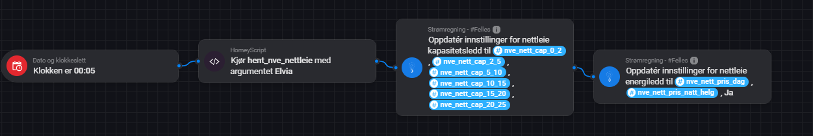

# homey-nve-nettleie
homey-pro  nve  nettleie  javascript  smart-home

# NVE Nettleie-henter for Homey Pro 🇳🇴

Dette skriptet henter offisielle nettleiepriser (energiledd og kapasitetsledd) direkte fra NVEs API. Det er spesialtilpasset for å fungere sømløst med **Strømregning-appen** i Homey.

## Funksjoner
* **Automatisk konvertering:** Regner om fra **øre til kroner** (kr/kWh) for å unngå "0-feil" i Strømregning-appen.
* **Universal:** Fungerer for alle norske nettselskaper via NVE-databasen.
* **Intelligent database:** Skriptet gjenkjenner automatisk om ditt nettselskap har identiske priser i flere fylker og serverer deg den enkleste konfigurasjonen mulig (**72 unike prismodeller støttes**).
* **Look-back algoritme:** Fyller automatisk ut "hull" i kapasitetsledd-data ved å arve pris fra nærmeste definerte trinn.
* **Støtter Tariffgrupper:** Velg mellom **Husholdning** eller **Hytter og fritidshus**.
* **Smart dato:** Henter automatisk priser for neste arbeidsdag hvis det kjøres i helgen.

## Oppsett
1. Kopier koden fra **hent_nve_nettleie.js** i dette prosjektet.
2. Opprett et nytt skript i Homey Web App.
3. Tilpass **NETTSELSKAP** øverst i koden til ditt selskap (f.eks. "Elvia").

## Flow-oppsett
For å automatisere oppdateringen, sett opp en Flow som kjører skriptet og kobler verdiene (Tags) til Strømregning-appen.

1. **Trigger:** Sett en tid (f.eks. hver natt kl. 00:05 eller ukentlig).
2. **Action 1 (HomeyScript):** Kjør skriptet **hent_nve_nettleie** og bruk nettselskapets ID som argument (f.eks. **elvia**).
3. **Action 2 (Strømregning):** Bruk kortet **Oppdatér innstillinger for nettleie kapasitetsledd** og koble til de numeriske taggene **nve_nett_cap_0_2** osv.
4. **Action 3 (Strømregning):** Bruk kortet **Oppdatér innstillinger for nettleie energiledd** og koble til **nve_nett_pris_dag** og **nve_nett_pris_natt_helg**.

## Tilleggsverktøy
I dette prosjektet finner du også hjelpeskript for feilsøking og konfigurasjon:

* **hent_nve_nettselskaper.js**: Dette er utgangspunktet for hele oppsettet. Skriptet brukes til å hente og identifisere de korrekte databasenavnene slik NVE har lagret dem. Output fra dette skriptet kopieres over som verdi i **NETTSELSKAP**-variabelen i hovedskriptet og test-skriptene.
* **test_nve_kapasitetledd.js**: Brukes for å teste kun uthenting av fastledd og kapasitetstrinn for ditt selskap.
* **test_nve_energiledd.js**: En ren testfil for å sjekke rådata fra NVEs API ved behov for feilsøking.

---
*Utviklet av **Glenn Pedersen** i samarbeid med Homey-miljøet. Takk til Tom Andreas H. Abrahamsen og Kai Engvik for bidrag til feilretting og testing.*
